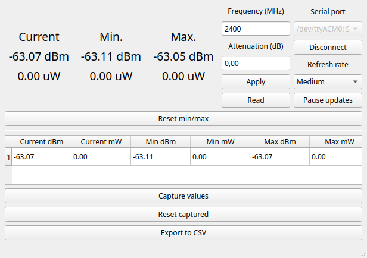

# USB Power Meter V5 GUI

An unofficial cross-platform software for the Chinese RF power meter

## Features

- Cross-platform compatibility
- Standalone one-file build
- And everything else you see on the screenshot below



## Usage

### Standalone build

1. Go to the latest release: https://github.com/whatmedoin/USBPowerMeterV5-GUI/releases/latest
2. Download the according binary file for your operating system
3. Run it!

### Manual python run

```
Required: Python 3.7+ (developed and tested on Python 3.11)
```

1. Clone this repository: `git clone https://github.com/whatmedoin/USBPowerMeterV5-GUI` (or download it as a ZIP)
2. Open the downloaded folder
3. (Optional, for PySide6 version) Checkout a different branch: `git checkout qt6`
4. (Optional, clean installation)
   1. Initialize a virtual environment for the dependencies: `python -m venv venv`
   2. Activate the environment:
      1. Run `source venv/bin/activate` in Linux terminal
      2. Run `venv\Scripts\activate` in Windows CMD
5. Install python dependencies: `pip install -r requirements.txt`
6. Run the script: `python power_meter.py`

## Building a standalone application

```
Note: this section is mainly for developers
```

This project uses [Nuitka](https://nuitka.net/) as a cross-platform app builder. However, it only works properly with the PySide6 version of the project, as [noted](https://nuitka.net/pages/pyqt5.html) in the documentation. Thus, for all further steps you will need to go through steps 1-5 above, inclusive step 3. Afterwards, install Nuitka: `pip install nuitka` and non-python [Nuitka dependencies](https://nuitka.net/doc/user-manual.html). Then run the build:

```bash
python -m nuitka --onefile --remove-output --disable-console --include-data-files=./powerMeter.ui=powerMeter.ui --enable-plugin=pyside6 power_meter.py
```

You will get an executable file named `power_meter.exe`/`power_meter.bin` in the root directory of the repository, according to the platform you built on (Windows/Linux).

Alternatively, you can fork this repository and run a [workflow](https://github.com/whatmedoin/USBPowerMeterV5-GUI/actions/workflows/main.yml), which will automatically build applications for the given systems. They will be available as artifacts in the finished workflow.

## Troubleshooting

This project is currently in testing state and has has some things to be implemented or fixed. If you found any problem, feel free to open an issue on [this](https://github.com/whatmedoin/USBPowerMeterV5-GUI/issues) page. You can also find some temporary workarounds to current bugs, if any.

## Contribution

This project is made in my free time and as soon as I fix critical bugs and implement some more nice features, the project won't be maintained any more. However, you can always fork this repository and add something yourself, which you can suggest via a pull request. And if I like it, your feature will be added to the main repository :)